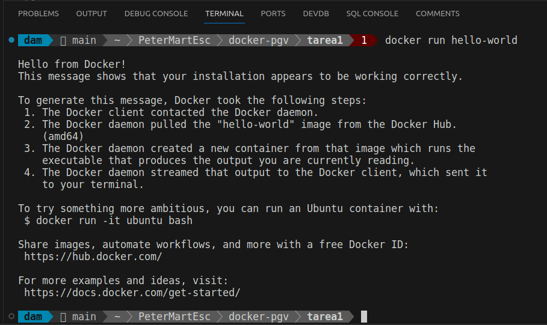
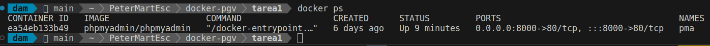
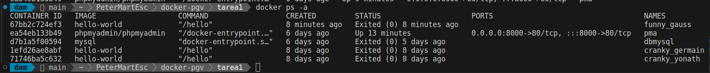
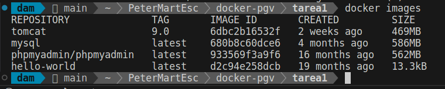

<div style="text-align: justify;">

#  Tarea 1 - Docker

### Paso 1: Trabajar con imágenes de Docker

Los contenedores de Docker se construyen con imágenes de Docker. Por defecto, Docker obtiene estas imágenes de Docker Hub, un registro de Docker gestionado por Docker, la empresa responsable del proyecto Docker. Cualquiera puede alojar sus imágenes en Docker Hub, de modo que la mayoría de las aplicaciones y las distribuciones de Linux que necesitará tendrán imágenes alojadas allí.

Para verificar si podemos acceder a imágenes y descargarlas de Docker Hub, usamos:

```bash
    docker run hello-world
```

Y nos devuelve lo siguiente:



### Paso 2: Administrar contenedores de Docker

Después de usar Docker durante un tiempo, tendremos varios contenedores en ejecución y otros inactivos. Para ver los activos, utilizamos lo siguiente:

```bash
    docker ps
```

Nos devuelve



A través de este tutorial, indicamos dos contenedores:

- La Imagen hello-world
- La Imagen ubuntu

Ambos contenedores ya no están en ejecución, pero aún existen en el sistema.

Para ver todos los contenedores, activos e inactivos, docker ps con el conmutador -a:

```bash
    docker ps -a
```

Y veremos lo siguiente:



También podemos ver el ultimo contenedor creado con el conmutador -l

```bash
    docker ps -l
```


Al listar las imágenes de Docker de nuevo:

```bash
    docker images
```

Mostrará la nueva imagen, así como la anterior de la que se derivó, mostrándonos lo siguiente



</div>
