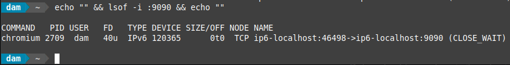

<div style="text-align: justify;">

#  Tarea 2 - Docker

## Objetivo:

Configurar un contenedor Docker que ejecute Apache Tomcat y que esté accesible desde un puerto específico en la máquina anfitriona.

Consulta los comandos de docker en el siguiente [enlace](https://github.com/jpexposito/bash-learn/blob/main/comun/docker/COMANDOS.md) proporcionado por el profesor.

### Paso 1: Preparación del Entorno

1.- Verificamos que Docker está instalado y funcionando con:

```bash
    docker --version
```

2.- Nos aseguramos de que ningún servicio en nuestra máquina está utilizando el puerto que queremos asignar. En mi caso usaré el 9090

### Paso 2: Descargar la Imagen de Tomcat

1.- Descargamos la imagen oficial de Apache Tomcat desde Docker Hub:

```bash
    docker pull tomcat
```

Obtenemos lo siguiente:


2.- Confirmamos que la imagen fue descargada correctamente con:

```bash
    docker images
```

En mi caso, ya estaba en el ordenador desde hace tiempo. La más reciente, y la versión 9.0:


### Paso 3: Ejecutar el Contenedor de Tomcat

1.- Iniciamos un contenedor basado en la imagen de Tomcat, y le asignamos un puerto específico (por ejemplo, 9090 en nuestra máquina anfitriona):

```bash
    docker run -d -p 9090:8080 --name tomcat-server-tarea2 tomcat
```
__Conmutadores:__

- `-d`: Hace que se ejecute el contenedor en segundo plano (no bloquea la terminal).
- `-p 9090:8080`: Mapea el puerto 8080 del contenedor al puerto 9090 de la máquina anfitriona, es decir, el 9090 escucha el puerto 8080 del contenedor.
- `--name tomcat-server-tarea2`: Asigna un nombre personalizado al contenedor.

Al lanzar el comando, obtenemos lo siguiente:


2.- Comprobamos si el contenedor está en ejecución:

```bash
    docker ps
```

Nos devuelve:


### Paso 4: Probar la Configuración

1.- Abrimos un navegador web y accedemos a la dirección:

`http://localhost:9090`

Que muestra lo siguiente:


Si estuviesemos usando Docker en un servidor remoto, reemplazaríamos `localhost` con la dirección IP del servidor.

Tanto si accedemos por el navegador como si no, comprobamos los logs del servidor para ver si el arranque ha sido correcto:

```bash
    docker logs tomcat-server-tarea2
```

Obteniendo: 


Verificamos también que no haya conflicto en los puertos:

```bash
    lsof -i :9090
```

Lo que nos devuelve:



### Paso 5: Detener y Eliminar el Contenedor

1.- Detenemos el contenedor:

```bash
    docker stop tomcat-server-tarea2
```

2.- Eliminamos el contenedor:

```bash
    docker rm tomcat-server
```
3.- En caso de querer eliminar la imagen de Tomcat de nuestro sistema:

```bash
    docker rmi tomcat
```


</div>