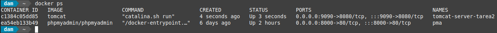
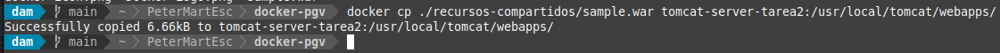
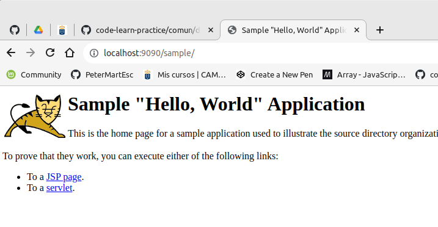
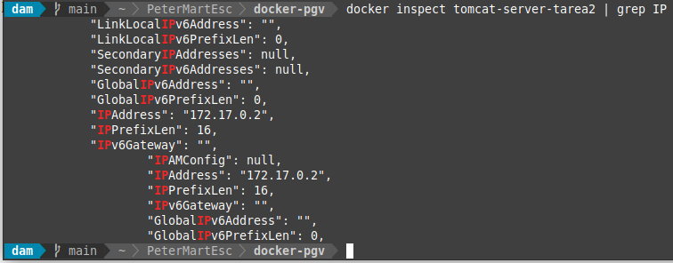

<div style="text-align: justify;">

#  Tarea 3 - Docker

## Objetivo

Desplegar una aplicación en Apache Tomcat.

Consulta los comandos de docker en el siguiente [enlace](https://github.com/jpexposito/code-learn/blob/main/comun/docker/COMANDOS.md) proporcionado por el profesor.

> Realiza los pasos de arranque de Tomcat descritos en la [tarea anterior](../tarea-2/).

> Debemos tener el contenedor docker corriendo



### Prueba con una aplicación de ejemplo

Como prueba, puedes descargamos una aplicación `.war` de ejemplo y la desplegamos en Tomcat siguiendo estos pasos:

#### 1. - Descargar un archivo `.war` de ejemplo

Descargamos una aplicación de ejemplo desde el sitio oficial de Apache Tomcat. Por ejemplo, la Sample Web [Application de Tomcat](https://tomcat.apache.org/tomcat-11.0-doc/appdev/sample/).

#### 2. - Copiar el archivo `.war` en el contenedor

Una vez descargado, lo copiamos al directorio webapps de nuestro contenedor Tomcat. Como estamos ejecutando Tomcat en Docker, ejecutamos:

```bash
    docker cp ./recursos-compartidos/sample.war tomcat-server-tarea2:/usr/local/tomcat/webapps/
```

__Conmutadores:__

- `docker cp`: Copia un archivo desde la máquina local al contenedor Docker donde está ejecutándose Tomcat.
- `/ruta/a/sample.war`: Especifica la ubicación del archivo .war en tu máquina.
- `<nombre_contenedor>`: El identificador o nombre del contenedor Docker que está ejecutando Tomcat.
- `/usr/local/tomcat/webapps/`: Es el directorio estándar donde Tomcat busca archivos .war para desplegar automáticamente.

Nos devuelve un mensaje de confirmación de la copia:



#### 3. - Acceder a la aplicación

Una vez copiado el archivo `.war` y desplegado en Tomcat, podremos acceder a la aplicación de ejemplo a través de la URL `http://localhost:9090/sample`

- `/sample`: Es el nombre de la aplicación, derivado del archivo .war.

Se nos muestra:



#### Verificar logs en caso de problemas

Si la aplicación de ejemplo tampoco funciona, revisaríamos los logs de Tomcat para detectar posibles errores:

```bash
    docker logs -f <nombre_contenedor>
```

Comprobamos si hay algú mensaje relacionado con el despliegue o errores en la configuración.

#### Utiliza docker inspect

Puedas o no acceder, intenta usar la IP del contenedor Docker (que puedes obtener con docker inspect).

```bash
    docker inspect tomcat-server
```




</div>
