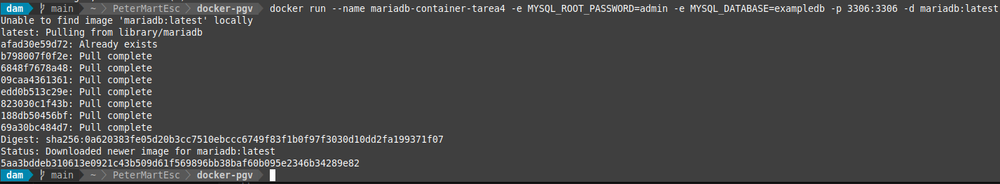
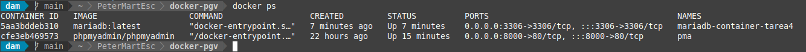
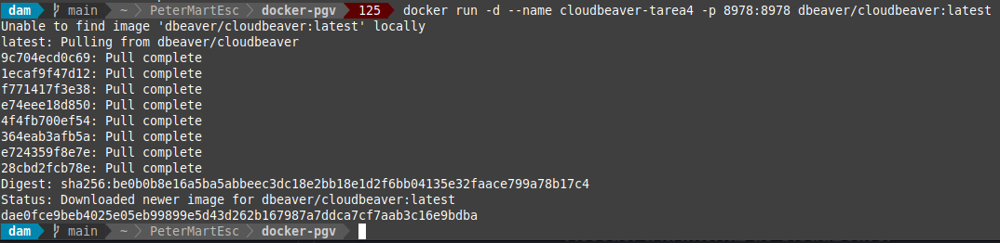
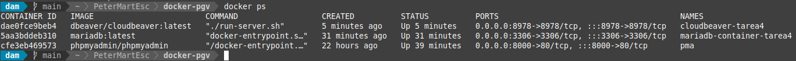
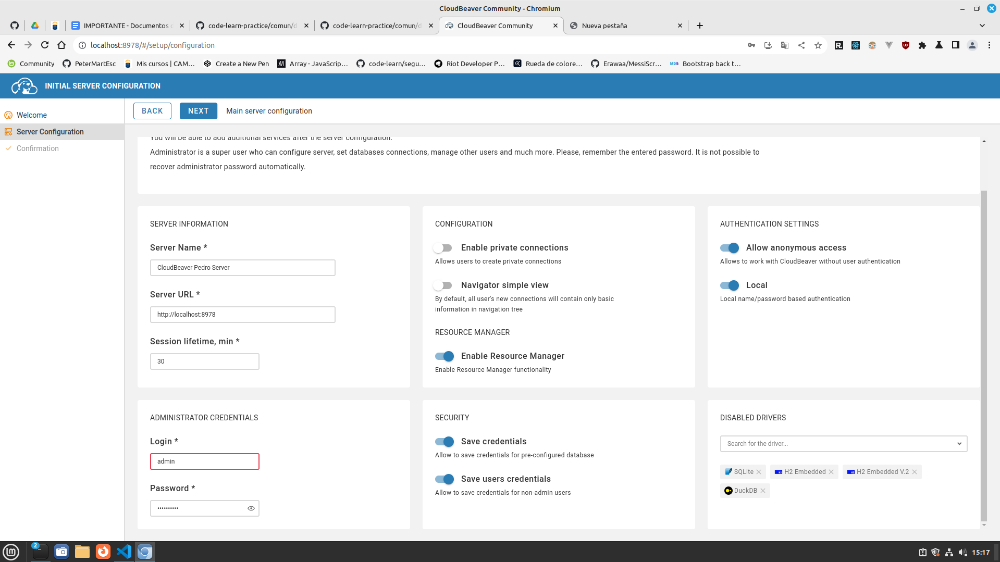
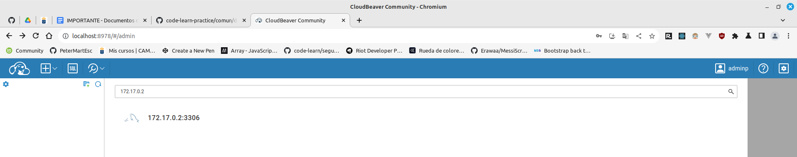
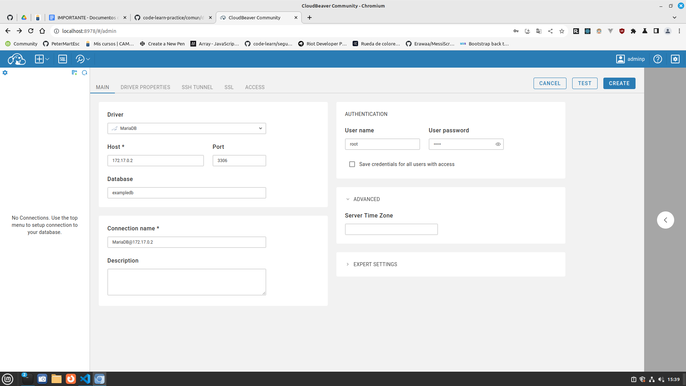
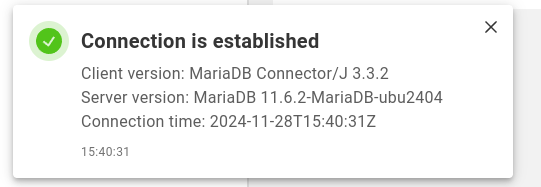
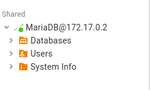

<div style="text-align: justify;">

#  Tarea 4 - Docker

## Objetivo

En este ejercicio, aprenderemos a instalar y configurar una base de datos MariaDB dentro de un contenedor docker, junto con un cliente de base de datos para interactuar con ella. Además, se explicarán cada uno de los pasos y parámetros utilizados en los comandos.

Consulta los comandos de docker en el siguiente [enlace](https://github.com/jpexposito/code-learn/blob/main/comun/docker/COMANDOS.md) proporcionado por el profesor.

> Recordar comprobar que el contenedor esta corriendo

## Descargar e iniciar un contenedor MariaDB

Ejecutaremos el siguiente comando para descargar la imagen oficial de MariaDB y crear un contenedor:

```bash
    docker run --name mariadb-container-tarea4 -e MYSQL_ROOT_PASSWORD=admin -e MYSQL_DATABASE=exampledb -p 3306:3306 -d mariadb:latest
```

__Explicacion del comando__

- `docker run`: Crea y ejecuta un contenedor.   
- `--name mariadb-container`: Asigna un nombre al contenedor, en este caso, mariadb-container.
- `-e MYSQL_ROOT_PASSWORD=admin`: Establece la contraseña para el usuario root.
- `-e MYSQL_DATABASE=exampledb`: Crea una base de datos inicial llamada exampledb.
- `-p 3306:3306`: Expone el puerto 3306 del contenedor al puerto 3306 del host (puerto estándar de MySQL/MariaDB).
- `-d`: Ejecuta el contenedor en segundo plano (modo "detached").
- `mariadb:latest`: Especifica la imagen de MariaDB que se usará, en este caso, la última versión disponible (latest).

Como la imagen de MariaDB no está descargada, la descargará e iniciará el contenedor



### Verificar que el contenedor esté corriendo

Ejecutamos `docker ps` para listar los contenedores en ejecución, y comprobamos que esté el de MariaDB corriendo.



### Verificar logs en caso de problemas

Si la aplicación de ejemplo no funcionase, tendríamos que revisar los logs de Tomcat para detectar posibles errores:

```bash
    docker logs -f <nombre_contenedor>
```

### Descargar un cliente de base de datos para MariaDB (Adminer)

En primer lugar debemos de encontrar un cliente de bbdd que este en docker. Uno de ellos, con una buena interfaz gráfica es CloudBeaver.

<div align="center">


</div>

Vamos a realizar los pasos para configurarar CloudBeaver, una versión web de DBeaver Community, para gestionar bases de datos MariaDB utilizando Docker.

### Descargar y ejecutar CloudBeaver en Docker

Ejecutamos el siguiente comando para iniciar un contenedor de CloudBeaver:

```bash
    docker run -d --name cloudbeaver -p 8978:8978 dbeaver/cloudbeaver:latest
```

- `docker run`: Crea y ejecuta un nuevo contenedor.
- `-d`: Ejecuta el contenedor en segundo plano.
- `--name cloudbeaver`: Asigna el nombre cloudbeaver al contenedor.
- `-p 8978:8978`: Mapea el **puerto 8978** del contenedor (puerto de CloudBeaver) al **puerto 8978** en tu máquina host. ***El puerto debe o puede estar ocupado por otra herramienta***.
- `dbeaver/cloudbeaver:latest`: Usa la imagen oficial de CloudBeaver, siempre actualizada a la última versión disponible.

Como ocurrió con la imagen de MariaDB, al no estár instalada, se descarga una e inicia el contendor automáticamente.

Comprobamos que se esté ejecutando con `docker ps -a`





### Acceder a la interfaz de CloudBeaver

Primero abrimos en el navegador web la dirección `http://localhost:8978`.

Seguimos las instrucciones de configuración inicial.

Realizamos la configuración del cliente:



### Encontrar la BBDD

CloudBeaver permite encontrar las BBDD que esten dentro de su red.

- `+` -> `Find DataBase`.
- En el buscador escribe `localhost`.



### Conectar CloudBeaver a MariaDB

__Pasos para la Conexión__

- Desde la interfaz de CloudBeaver, selecciona `New Connection (Nueva conexión)`.
- Selecciona `MariaDB/MySQL` como tipo de base de datos.
- Introduce los datos de conexión:
 Host: `ip` -> `192.168....`.
- Puerto: `3306` *(el puerto configurado para MariaDB)*.
- Usuario: `root` *(u otro usuario configurado)*.
- Contraseña: `admin` *(o la contraseña configurada para el usuario)*.
- Base de datos: `exampledb` *(u otra base de datos que hayas configurado).



Hacemos click en `Test` para testear la conexión

<div align=center>
    
</div>

Si la conexión es exitosa, hacemos click en `Create`

<div align=center>
    
</div>

### Detener y eliminar contenedores

Cuando terminamos de trabajar con CloudBeaver/MariaBD, podemos detener y eliminar el contenedor con los siguientes comandos:

```bash
docker stop <nombre-contenedor>
```

Y para eliminar un contenedor

```bash
docker rm <nombre-contenedor>
```


</div>