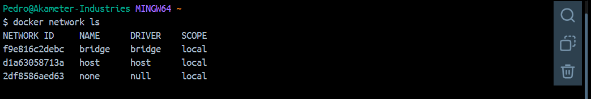
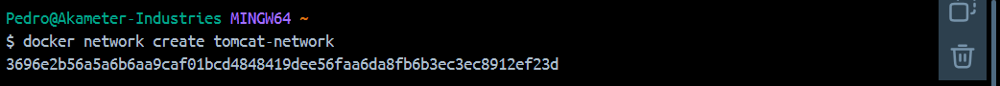

<div style="text-align: justify;">

#  Tarea 5 - Docker

## Objetivo

Configurar un balanceador de carga [NGINX](https://kinsta.com/es/base-de-conocimiento/que-es-nginx/) que distribuya el tráfico entre dos servidores [Tomcat](https://es.wikipedia.org/wiki/Tomcat) ejecutados en contenedores Docker.

Consulta los comandos de docker en el siguiente [enlace](https://github.com/jpexposito/code-learn/blob/main/comun/docker/COMANDOS.md), y las redes en docker en el siguiente [enlace](https://github.com/jpexposito/code-learn/tree/main/comun/docker/ud-5), ambos aportados por el profesor.

## Redes Disponibles

Listamos el conjunto de redes disponibles en este momento mediante:

```bash
    docker network ls
```

Obteniendo lo siguiente:



## Pasos a Seguir

### 1. - Crear una Red Docker

Docker necesita una red personalizada para que los contenedores puedan comunicarse entre sí. Ejecutamos el siguiente comando:

```bash
    docker network create tomcat-network
```

__Explicación del comando:__

- `docker network create`: Crea una nueva red Docker.
- `tomcat-network`: Es el nombre de la red personalizada.



### 2. - Levanta los Servidores Tomcat

A continuación, levantamos dos contenedores Tomcat y los conectamos a la red creada anteriormente (tomcat-network).

__Servidor Tomcat 1__

```bash
    docker run -d --name tomcat1 --network tomcat-network -p 8081:8080 tomcat:latest
```

__Servior Tomcat 2__

```bash
    docker run -d --name tomcat2 --network tomcat-network -p 8081:8080 tomcat:latest
```

__Explicación comandos__

Como ya hemos mencionado anteriormente:

- `docker run`: Crea y ejecuta un contenedor.
- `-d`: Ejecuta el contenedor en segundo plano (modo "detached").
- `--name <nombre-contenedor>`: Asigna nombres a los contenedores para identificarlos.
- `--network tomcat-network`: Conecta los contenedores a la red personalizada creada al principio.
- `-p 8081:8080 y -p 8082:8080`: Expone el puerto 8080 de ambos contenedores, en los puertos 8081 y 8082 de la máquina anfitriona.
- `tomcat:latest`: Usa la última versión de la imagen oficial de Tomcat.


</div>