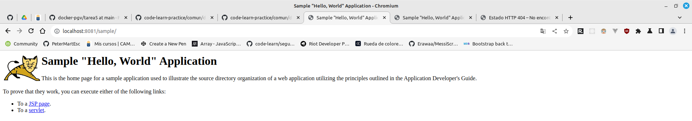

<div style="text-align: justify;">

#  Tarea 5 - Docker

## Objetivo

Configurar un balanceador de carga [NGINX](https://kinsta.com/es/base-de-conocimiento/que-es-nginx/) que distribuya el tráfico entre dos servidores [Tomcat](https://es.wikipedia.org/wiki/Tomcat) ejecutados en contenedores Docker.

Consulta los comandos de docker en el siguiente [enlace](https://github.com/jpexposito/code-learn/blob/main/comun/docker/COMANDOS.md), y las redes en docker en el siguiente [enlace](https://github.com/jpexposito/code-learn/tree/main/comun/docker/ud-5), ambos aportados por el profesor.

## Redes Disponibles

Listamos el conjunto de redes disponibles en este momento mediante:

```bash
    docker network ls
```

Obteniendo lo siguiente:


## Pasos a Seguir

### 1. - Crear una Red Docker

Docker necesita una red personalizada para que los contenedores puedan comunicarse entre sí. Ejecutamos el siguiente comando:

```bash
    docker network create tomcat-network
```

__Explicación del comando:__

- `docker network create`: Crea una nueva red Docker.
- `tomcat-network`: Es el nombre de la red personalizada.


### 2. - Levanta los Servidores Tomcat

A continuación, levantamos dos contenedores Tomcat y los conectamos a la red creada anteriormente (tomcat-network).

__Servidor Tomcat 1__

```bash
    docker run -d --name tomcat1 --network tomcat-network -p 8081:8080 tomcat:latest
```

__Servior Tomcat 2__

```bash
    docker run -d --name tomcat2 --network tomcat-network -p 8082:8080 tomcat:latest
```

__Explicación comandos__

Como ya hemos mencionado anteriormente:

- `docker run`: Crea y ejecuta un contenedor.
- `-d`: Ejecuta el contenedor en segundo plano (modo "detached").
- `--name <nombre-contenedor>`: Asigna nombres a los contenedores para identificarlos.
- `--network tomcat-network`: Conecta los contenedores a la red personalizada creada al principio.
- `-p 8081:8080 y -p 8082:8080`: Expone el puerto 8080 de ambos contenedores, en los puertos 8081 y 8082 de la máquina anfitriona.
- `tomcat:latest`: Usa la última versión de la imagen oficial de Tomcat.

### 3. - Muestra los contenedores dockers activos en ese momento

Mostramos el listado de contenedores docker que tenemos activos y todos los que tenemos disponibles.

```bash
    docker ps -a
```

Lo que nos debería devolver algo parecido a:


### 4. - Fichero de Configuración del Balanceador NGINX

En este punto, crearemos el fichero de balance `nginx.conf` en el mismo direcctorio donde estemos ejecutando la `consola de comandos`.

```code
events {}

http {
    upstream tomcat_backend {
        server tomcat1:8080;
        server tomcat2:8080;
    }

    server {
        listen 80;

        location / {
            proxy_pass http://tomcat_backend;
            proxy_set_header Host $host;
            proxy_set_header X-Real-IP $remote_addr;
            proxy_set_header X-Forwarded-For $proxy_add_x_forwarded_for;
        }
    }
}
```

Luego lanzaremos:

```bash
    docker run -d --name nginx --network tomcat-network -p 80:80 -v ./nginx.conf:/etc/nginx/nginx.conf nginx:latest
```

__Explicación comando__

Aparte de lo ya explicado en otros puntos, tenemos una nueva parte añadida al comando:

- `-v ./nginx.conf:/etc/nginx/nginx.conf nginx:latest`: monta (copia) el archivo de configuración que hemos creado anteriormente, desde el directorio actual donde se está lanzando (`./nginx.conf`), en el directorio especificado del contenedor docker que estamos creando (`/etc/nginx/nginx.conf nginx:latest`).

Luego de ejecutar el comando, vemos algo parecido a lo siguiente:


## Verificar que todo esta funcionando correctamente

### 5. - Servidor NGINX

Verifica el comportamiento en:

```
    http://localhost:8081
```

```
    http://localhost:8082
```

```
    http://localhost
```

```
    http://localhost:80
```

Debido a que 

Si vemos el mensaje estandar de que están funcionando en dichos puertos, continuamos .

Realizamos el despliegue de la aplicación sample como se describe en la [tarea 3](../tarea3/).

Luego repetimos los pasos del apartado anterior comprobando los puertos 8081,8082 y 80 de localhost.

Capturas accediendo a /sample en cada contenedor de Tomcat




Captura del contenedor de nginx con el sample y sin el sample


</div>