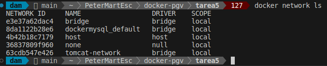
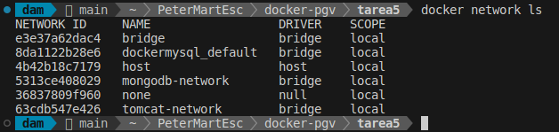
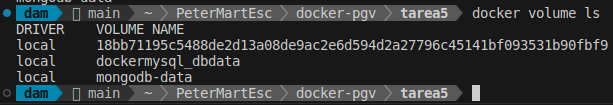
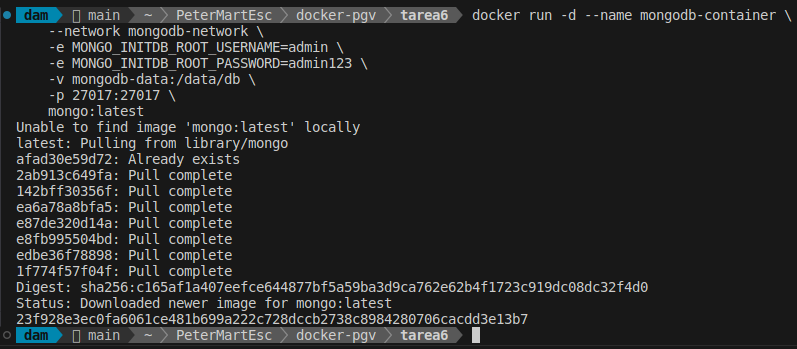
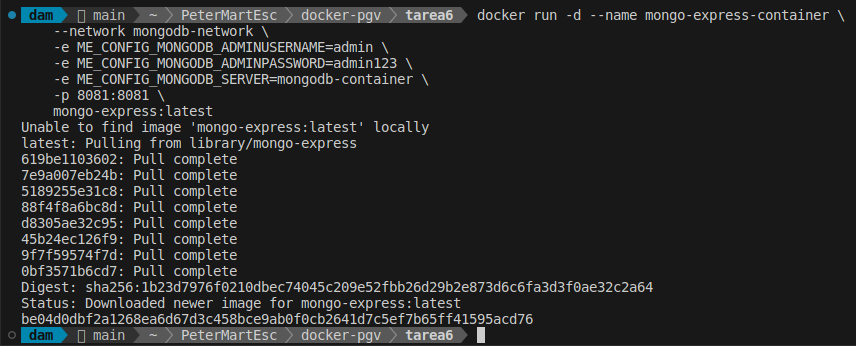
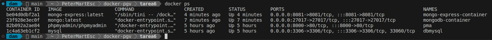

<div style="text-align: justify;">

#  Tarea 6 - Docker

## Objetivo

Conectar una Base de Datos NoSQL con un Cliente de Base de Datos.

Consulta los comandos de docker en el siguiente [enlace](https://github.com/jpexposito/code-learn/blob/main/comun/docker/COMANDOS.md), y las redes en docker en el siguiente [enlace](https://github.com/jpexposito/code-learn/tree/main/comun/docker/ud-5), ambos aportados por el profesor.

## Volumenes Docker

En Docker, un volumen es un mecanismo para almacenar y compartir datos entre contenedores o entre el host y los contenedores. Los volúmenes son administrados por Docker y permiten persistir datos incluso si el contenedor es eliminado. Esto es útil para mantener datos importantes, como bases de datos, configuraciones o cualquier otro archivo que necesite persistencia.

__Ventajas de usar volúmenes:__

- `Persistencia`: Los datos no se pierden cuando el contenedor se detiene o elimina.
- `Compartición`: Permiten compartir datos entre varios contenedores.
- `Flexibilidad`: Docker administra los volúmenes, asegurando un almacenamiento eficiente y una fácil gestión.

## Redes disponibles

Listamos el conjunto de redes disponibles en este momento.

```bash
    docker network ls
```



## Pasos del Ejercicio

### 1. - Crear una Red Personalizada

Ejecutamos el siguiente comando para crear una red llamada mongodb-network:

```bash
    docker network create mongodb-network
```



### 2. - Crear un Volumen para MongoDB

Ejecutamos el siguiente comando para crear un volumen llamado mongodb-data:

```bash
    docker volume create mongodb-data
```

> Esto permitirá que los datos de MongoDB persistan incluso si el contenedor se elimina.

Ejecutamos `docker volume ls`, y mostramos el resultado:



### 3. - Levantar el Contenedor MongoDB

Usamos el siguiente comando para ejecutar MongoDB con el volumen y la red configurados:

```bash
    docker run -d --name mongodb-container \
    --network mongodb-network \
    -e MONGO_INITDB_ROOT_USERNAME=admin \
    -e MONGO_INITDB_ROOT_PASSWORD=admin123 \
    -v mongodb-data:/data/db \
    -p 27017:27017 \
    mongo:latest
```

Explicación de los parámetros:

- `--network mongodb-network`: Conecta el contenedor a la red personalizada.
- `-v mongodb-data:/data/db`: Asocia el volumen mongodb-data al directorio `/data/db`, que es donde `MongoDB` almacena sus datos.



### 4. - Levantar el Contenedor Mongo Express

Mongo Express es un cliente web para gestionar MongoDB. Usamos este comando para levantar el contenedor:

```bash
    docker run -d --name mongo-express-container \
    --network mongodb-network \
    -e ME_CONFIG_MONGODB_ADMINUSERNAME=admin \
    -e ME_CONFIG_MONGODB_ADMINPASSWORD=admin123 \
    -e ME_CONFIG_MONGODB_SERVER=mongodb-container \
    -p 8081:8081 \
    mongo-express:latest
```

Explicación de los parámetros:

- `--network mongodb-network`: Conecta el contenedor a la misma red que MongoDB.
- `-e ME_CONFIG_MONGODB_SERVER=mongodb-container`: Indica que Mongo Express debe conectarse al contenedor mongodb-container.

Obtendremos una solución similar a la siguiente:



### 5. - Verificar los Contenedores Activos

Listamos los contenedores activos con `docker ps` para asegurarnos de que están funcionando correctamente:



Podemos observar ambos contenedores, con `MongoDB` en el puerto `27017` y `Mongo Express` en el puerto `8081`.

### 6. - Verifica los logs de Mongo Express

Verifica los logs de Mongo Express:

```bash
    docker logs mongo-express-container
```
> Nota: en el logs obtendremos la contraseña para acceder, ya que lo indicado anteriormente no se ha establecido

```bash
    Mongo Express server listening at http://0.0.0.0:8081
    Server is open to allow connections from anyone (0.0.0.0)
    basicAuth credentials are "admin:pass", it is recommended you change this in your config.js!
```

Accedemos al Cliente Mongo Express Abre tu navegador y comprobamos:

```bash
    localhost:8081
```

</div>

fast image