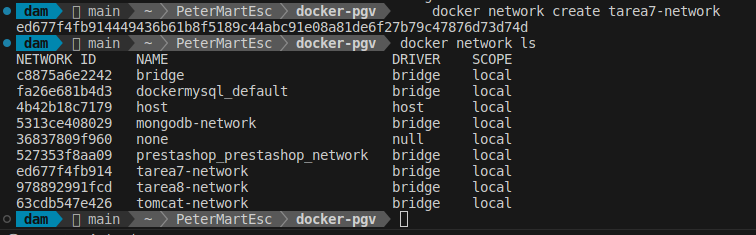
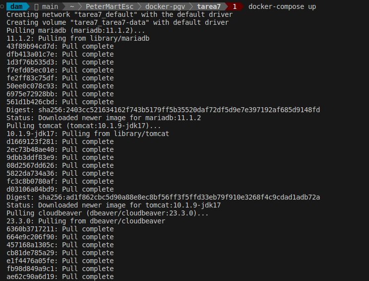

<div style="text-align: justify;">

#  Tarea 7 - Docker

## Dockerfile

Un Dockerfile es un archivo de texto que contiene instrucciones para automatizar la creación de imágenes de Docker. Estas imágenes se utilizan para configurar contenedores con el entorno y las aplicaciones necesarias. El Dockerfile permite personalizar el contenido de las imágenes, definiendo dependencias, configuraciones, puertos, variables de entorno y más.

## Características de un Dockerfile

#### 1. Definición Declarativa
Un Dockerfile permite definir de forma declarativa todos los pasos necesarios para crear una imagen, desde la elección de la imagen base hasta la configuración de servicios.

#### 2. Automatización
Permite automatizar la creación de imágenes de manera consistente, lo que elimina errores manuales y asegura que todos los entornos tengan configuraciones idénticas.

#### 3. Reproducibilidad
El mismo Dockerfile puede usarse en diferentes entornos para construir imágenes idénticas, asegurando consistencia en el desarrollo, pruebas y producción.

#### 4. Compatibilidad
Las imágenes creadas a partir de un Dockerfile son portables y pueden ejecutarse en cualquier máquina con Docker instalado.

#### 5. Optimización
Docker utiliza un sistema de caché de capas que evita repetir pasos innecesarios al construir una imagen, lo que acelera el proceso.

## Instrucciones Principales en un Dockerfile

Un Dockerfile utiliza instrucciones específicas para definir cómo se construirá una imagen. A continuación, se describen las principales instrucciones utilizadas en la creación de imágenes Docker.

#### 1. FROM
Define la imagen base que se usará como punto de partida para construir la nueva imagen. Es obligatorio y suele ser la primera instrucción en el Dockerfile.

```bash
FROM python:3.9-slim
```

#### 2. RUN
Ejecuta comandos durante la construcción de la imagen. Esta instrucción se utiliza comúnmente para instalar dependencias o realizar configuraciones en el sistema operativo base.

```bash
RUN apt-get update && apt-get install -y curl
```

#### 3. COPY
Copia archivos o directorios desde la máquina anfitriona al sistema de archivos de la imagen Docker. Es útil para incluir aplicaciones, scripts o configuraciones.

```bash
COPY ./app.py /usr/src/app/
```
#### 4. CMD
Especifica el comando que se ejecutará por defecto cuando se inicie un contenedor basado en esta imagen. Solo puede haber un CMD en un Dockerfile.

```bash
CMD ["python", "/usr/src/app/app.py"]
```

#### 5. ENTRYPOINT
Configura el contenedor para que ejecute un programa o script principal. A diferencia de CMD, ENTRYPOINT puede aceptar parámetros adicionales al ejecutar el contenedor.

```bash
ENTRYPOINT ["python"]
CMD ["/usr/src/app/app.py"]
```
#### 6. ENV
Define variables de entorno que estarán disponibles dentro del contenedor. Es útil para configurar la aplicación o servicios dentro del contenedor.

```bash
ENV APP_ENV=production
```

#### 7. EXPOSE
Declara los puertos que se usarán en el contenedor. Esto es informativo y debe combinarse con -p o --publish al iniciar el contenedor para mapear los puertos al anfitrión.

```bash
EXPOSE 8080
```

#### 8. WORKDIR
Establece el directorio de trabajo dentro del contenedor. Todas las instrucciones posteriores utilizarán este directorio como referencia.

```bash
WORKDIR /usr/src/app
```

#### 9. ADD
Similar a COPY, pero incluye funcionalidades adicionales, como la capacidad de extraer automáticamente archivos comprimidos o descargar archivos desde una URL.

```bash
ADD my-archive.tar.gz /my-folder/
```

#### 10. ARG
Declara variables que se pueden pasar como argumentos en el momento de la construcción de la imagen. Estas variables no estarán disponibles dentro del contenedor en tiempo de ejecución.

```bash
ARG VERSION=1.0
```

#### 11. LABEL
Agrega metadatos a la imagen Docker, como información del autor, versión o descripciones. Es útil para documentar la imagen.

```bash
LABEL maintainer="admin@example.com"
```

#### 12. VOLUME
Declara un punto de montaje para persistencia de datos. Los datos en un volumen sobreviven incluso si el contenedor es eliminado.

```bash
VOLUME /data
```

#### 13. ONBUILD

Especifica instrucciones que se ejecutarán automáticamente cuando otra imagen se construya basada en esta. Es útil para crear imágenes base reutilizables.

```bash
ONBUILD RUN apt-get update && apt-get install -y python3
```

Un pequeño ejemplo de dockerfile es el siguiente:

```bash
# Usar una imagen base de Python
FROM python:3.9-slim

# Establecer el directorio de trabajo dentro del contenedor
WORKDIR /app

# Copiar el archivo Python de la máquina local al contenedor
COPY app.py .

# Instalar las dependencias necesarias
RUN pip install --no-cache-dir flask

# Exponer el puerto que la aplicación utilizará
EXPOSE 5000

# Comando para ejecutar la aplicación cuando el contenedor arranca
CMD ["python", "app.py"]
```

> Consulta los comandos de docker en el siguiente [enlace](https://github.com/jpexposito/code-learn/blob/main/comun/docker/COMANDOS.md), y las redes en docker en el siguiente [enlace](https://github.com/jpexposito/code-learn/tree/main/comun/docker/ud-6) aportados por el profesor.

## Objetivo

El objetivo de este ejercicio es crear un entorno con Docker que incluya un servidor `Tomcat`, una base de datos `MariaDB` y un `cliente para acceder a la base de datos`. Para esto, configuraremos los contenedores con `redes personalizadas` y un `volumen común` para persistir datos.

#### Requisitos

- Crear una red Docker personalizada para los contenedores.
- Crear un contenedor Tomcat para desplegar una aplicación web.
- Crear un contenedor MariaDB para gestionar la base de datos.
- Utilizar un volumen común para persistir los datos de la base de datos.

Para cumplir estos requisitos iniciales, realizaremos lo siguiente:

##### Paso 1: Creamos una red Docker personalizada para que los contenedores puedan comunicarse entre sí:

```bash
    docker network create tarea7-network
```



##### Paso 2: Creamos un volumen comun para persistir los datos de la bbdd

```bash
    docker volume create tarea7-data
```


##### Paso 3: Creamos un Docker Compose

Lo logico sería crear un Dockerfile para gestionar los contenedores, pero como vamos a crear varios contenedores a partir de varias imagenes de docker, lo mejor es hacer un docker-compose para automatizar la creación.

```bash
version: '3.3'
services:
  mariadb:
    image: mariadb:11.1.2
    container_name: mariadb
    environment:
      MYSQL_ROOT_PASSWORD: root
      MYSQL_DATABASE: exampledb
    networks:
      - tarea7-network
    volumes:
      - tarea7-data:/var/lib/mysql
    ports:
      - "3306:3306"

  tomcat:
    image: tomcat:10.1.9-jdk17
    container_name: tomcat
    networks:
      - tarea7-network
    ports:
      - "8081:8081"
    volumes:
      - ./sample.war:/usr/local/tomcat/webapps/sample.war

  cloudbeaver:
    image: dbeaver/cloudbeaver:23.3.0
    container_name: cloudbeaver
    networks:
      - tarea7-network
    ports:
      - "8978:8978"
```

#### ¿Qué estamos haciendo?

Explicación del Docker Compose:


##### Paso 4: Construir y ejecutar la imagen

Para construir las imagenes a partir del docker compose, usaríamos

```bash
    docker-compose up
```

> Recuerda añadir `-d` si quieres que se ejecute en 2o plano




Lista los contenedores que tienes en tu equipo:

```bash
    docker ps -a 
```


Y ahora deberíamos poder entrar desde el puerto de CloudBeaver `http://localhost:8978/`

</div>
