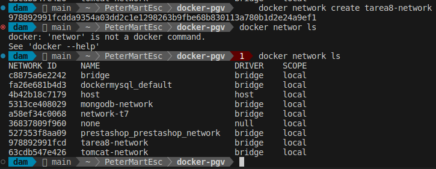
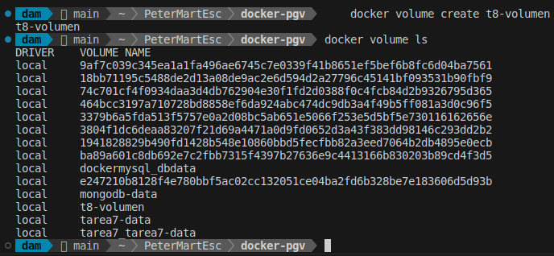
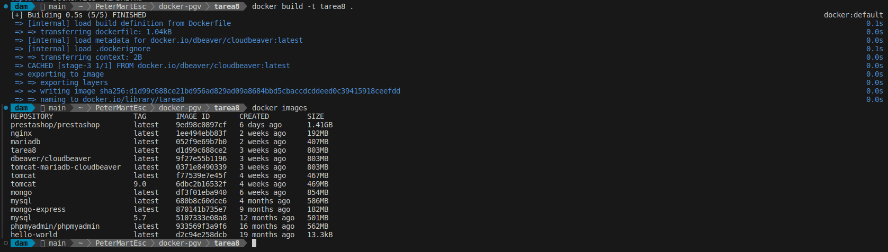
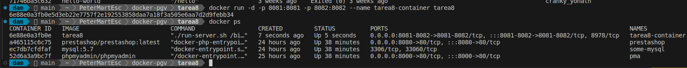

<div align=justify>

#  Tarea 8 - Docker

## Objetivo

El objetivo de este ejercicio es crear un entorno con Docker que incluya dos servidores Tomcat, una base de datos MariaDB y una bbdd no sql y así como los clientes para acceder a ambas bases de datos. Para esto, configuraremos los contenedores con redes personalizadas y un volumen común para persistir datos.

## Requisitos

- Crear una red Docker personalizada para los contenedores.
- Crear un conjunto de contenedores Tomcat para desplegar las aplicaciones web.
- Crear un contenedor MariaDB para gestionar la base de datos.
- Crear un contenedor Mongodb para gestionar la base de datos no sql.
- Utilizar un volumen común para persistir los datos de la base de datos.

---

## Pasos

### Paso 1: Crea la red personalizada

Primero, creamos una red Docker personalizada para que los contenedores puedan comunicarse entre sí.

```bash
    docker network create tarea8-network
```



### Paso 2: Crear un volumen común

Luego, creamos un volumen Docker para persistir los datos.

```bash
    docker volume create tarea8-volumen
```



### Paso 3: Crear el Dockerfile

A continuación, creamos un Dockerfile que instalará Tomcat, MariaDB y CloudBeaver.

```bash
# Usar una imagen base de Ubuntu para las instalaciones adicionales
FROM ubuntu:20.04

# Instalar dependencias necesarias (como wget y curl)
RUN apt-get update -y && \
    apt-get install -y \
    wget \
    curl \
    unzip \
    mysql-client \
    && rm -rf /var/lib/apt/lists/*

# Configurar MariaDB usando la imagen oficial
FROM mariadb:10.5

# Configurar Tomcat usando la imagen oficial
FROM tomcat:9.0

# Descargar y configurar CloudBeaver utilizando la imagen oficial de CloudBeaver desde Docker Hub
FROM dbeaver/cloudbeaver:latest

# Exponer puertos
EXPOSE 8081 8082

# Volúmenes para MariaDB
VOLUME /var/lib/mysql

# Configuración de MariaDB: Establecer la contraseña root y crear la base de datos (esto es suficiente con las variables de entorno)
ENV MYSQL_ROOT_PASSWORD=root
ENV MYSQL_DATABASE=exampledb

# Iniciar los servicios de MariaDB, Tomcat y CloudBeaver
CMD service mysql start && \
    /opt/tomcat/bin/catalina.sh run & \
    /opt/cloudbeaver/cloudbeaver/bin/cloudbeaver & \
    wait
```

### Paso 4: Construir y ejecutar la imagen

Para construir la imagen desde el Dockerfile, usa el siguiente comando:

```bash
    docker build -t tarea8 .
```



Luego, para ejecutar el contenedor que contiene Tomcat, MariaDB,CloudBeaver, etc y usa:

```bash
    docker run -d -p 8081:8081 -p 8082:8082 --name tarea8-container tarea8 
```



---

## Detener y eliminar contenedores

Cuando termines de trabajar, puedes detener y eliminar el contenedor con los siguientes comandos:

```bash
docker stop <nombre-contenedor>
```

> Para eliminar un contenedor
>
>```bash
>    docker rm <nombre-contenedor>
>```

---

</div>