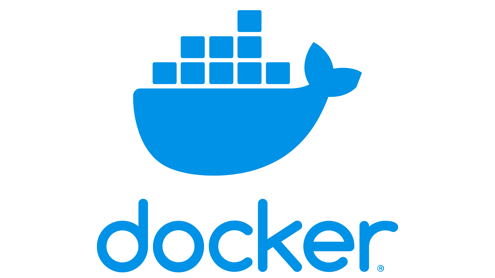
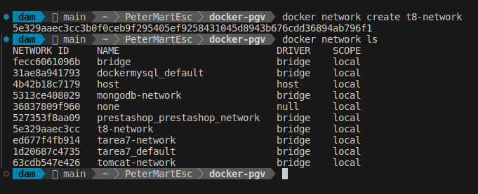

<div align=justify>

#  Tarea 8 - Docker

## Objetivo

El objetivo de este ejercicio es crear un entorno con Docker que incluya dos servidores `Tomcat`, una base de datos `MariaDB` y una `bbdd no sql` y así como los clientes para acceder a ambas bases de datos. Para esto, configuraremos los contenedores con redes personalizadas y un `volumen común` para persistir datos.

---

## Docker Compose

Docker Compose es una herramienta que permite definir y ejecutar aplicaciones de Docker de múltiples contenedores. A través de un archivo `YAML` (generalmente llamado `docker-compose.yml`), puedes definir todos los servicios, redes y volúmenes que tu aplicación necesita. Docker Compose facilita la orquestación de contenedores, permitiendo gestionar proyectos más complejos que requieren la interacción de varios contenedores.

## ¿Por qué usar Docker Compose?

En muchos casos, las aplicaciones modernas consisten en varios componentes que se ejecutan en contenedores independientes. Esto puede incluir bases de datos, servidores web, aplicaciones backend, y más. Docker Compose facilita la gestión de estas aplicaciones multicontenedor de manera simple y eficiente. Algunas de las razones para usar Docker Compose son:

- __Orquestación de múltiples contenedores__: Puedes definir, ejecutar y administrar múltiples contenedores a la vez.
- __Automatización__: Facilita la configuración de servicios y redes entre contenedores, evitando tener que configurar manualmente cada uno de ellos.
- __Desarrollo local__: Permite a los desarrolladores crear entornos completos de desarrollo local con solo un comando.
- __Portabilidad__: Puedes definir entornos consistentes que se pueden compartir fácilmente entre diferentes máquinas o equipos de desarrollo.

## Componentes principales de Docker Compose

Docker Compose utiliza un archivo `YAML` donde se definen los siguientes componentes principales:

1. __Version__:
Define la versión del archivo de configuración de `Docker Compose`. Asegura que se utilicen las características adecuadas de Docker y Docker Compose.

2. __Services__:
Especifica los contenedores que formarán parte de la aplicación. Cada servicio corresponde a un contenedor y puede incluir configuraciones como:

- Imagen del contenedor.
- Puertos que deben exponerse.
- Volúmenes que deben montarse.
- Variables de entorno necesarias para la configuración del contenedor.

3. __Volumes__:
Define los volúmenes persistentes que se utilizan para almacenar datos entre reinicios de contenedores. Esto es útil para bases de datos o cualquier servicio que necesite almacenar datos.

4. __Networks__:
Configura redes personalizadas para que los contenedores puedan comunicarse entre sí. Esto es útil cuando se necesita aislar los contenedores de otros servicios externos.

---

## ¿Cómo funciona Docker Compose?

Docker Compose funciona con los siguientes pasos:

- __Definir la configuración__: Crear un archivo `docker-compose.yml` que describa los contenedores, sus redes y volúmenes necesarios.
- __Levantar los contenedores__: Usando el comando `docker-compose up`, Docker Compose descargará las imágenes necesarias, creará los contenedores y los levantará según la configuración especificada.
- __Escalar y gestionar servicios__: Docker Compose permite escalar servicios (por ejemplo, ejecutar múltiples instancias de un contenedor) y gestionar su ciclo de vida, como detener, reiniciar o eliminar contenedores.
- __Conexión entre servicios__: Los contenedores definidos en Docker Compose pueden interactuar entre sí fácilmente a través de redes configuradas en el archivo `docker-compose.yml`.

## Ejemplo básico de un archivo `docker-compose.yml`

```bash
version: '3.9'

services:
  web:
    image: nginx:latest
    ports:
      - "8080:80"
  db:
    image: mysql:5.7
    environment:
      MYSQL_ROOT_PASSWORD: example
```

En este ejemplo:

- __Se definen dos servicios__: un contenedor `web` que usa la imagen de `Nginx` y un contenedor `db` que usa la imagen de `MySQL`.
- __web__: expone el puerto `8080` en la máquina anfitriona para acceder al servidor web.
- __db__: configura una variable de entorno para establecer la contraseña del usuario root de la base de datos.
---

## Realiza

- Crear una solución `Docker` personalizada para los contenedores.
- Crear un conjunto de contenedores `Tomcat` para desplegar las aplicaciones web.
- Crear un contenedor `MariaDB` para gestionar la base de datos.
- Crear un contenedor `Mongodb` para gestionar la base de datos no sql.
- Utilizar un `volumen común` para persistir los datos de la base de datos.

## Pasos

### Paso 1: Crea la red personalizada

Primero, creamos una red Docker personalizada para que los contenedores puedan comunicarse entre sí. Si no la creásemos, el propio docker compose la crearia al lanzarse.

```bash
    docker network create t8-network
```



### Paso 2: Crear un volumen común

Luego, creamos un volumen Docker para persistir los datos. De igual forma, si no estuviese creado, el composer instal lo crearía

```bash
    docker volume create t8-volumen
```


### Paso 3: Crear el Dockerfile

A continuación, creamos un Docker Compose que instalará los contenedores Tomcat, MariaDB y CloudBeaver.

```bash
version: '3.3'
services:

  mariadb:
    image: mariadb:11.1.2
    container_name: t8-mariadb
    environment:
      MYSQL_ROOT_PASSWORD: root
      MYSQL_DATABASE: exampledb
    networks:
      - t8-network
    ports:
      - "3306:3306"
    volumes:
      - t8-volumen:/var/lib/mysql

  tomcat:
    image: tomcat:10.1.9-jdk17
    container_name: t8-tomcat1
    networks:
      - t8-network
    ports:
      - "8081:8081"
    volumes:
      - ./sample.war:/usr/local/tomcat/webapps/sample.war

  tomcat:
    image: tomcat:10.1.9-jdk17
    container_name: t8-tomcat2
    networks:
      - t8-network
    ports:
      - "8082:8082"
    volumes:
      - ./sample.war:/usr/local/tomcat/webapps/sample.war

  cloudbeaver:
    image: dbeaver/cloudbeaver:23.3.0
    container_name: t8-cloudbeaver
    networks:
      - t8-network
    ports:
      - "8978:8978"

volumes:
  t8-volumen:

networks:
  t8-network:
    driver: bridge
```

### Paso 4: Construir y ejecutar la imagen

Para construir la imagen desde el Dockerfile, usa el siguiente comando:

```bash
    docker build -t tarea8 .
```


Luego, para ejecutar el contenedor que contiene Tomcat, MariaDB,CloudBeaver, etc y usa:

```bash
    docker run -d -p 8081:8081 -p 8082:8082 --name tarea8-container tarea8 
```


---

## Detener y eliminar contenedores

Cuando termines de trabajar, puedes detener y eliminar el contenedor con los siguientes comandos:

```bash
docker stop <nombre-contenedor>
```

> Para eliminar un contenedor
>
>```bash
>    docker rm <nombre-contenedor>
>```

---

</div>